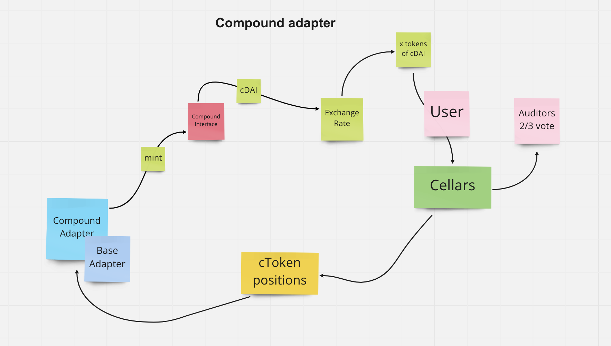

# Sommelier Finance 🍷

We have created an adapter for Sommelier in our project for two mains raisons : 

- CreditScore is depend on borrowing and one way that we can improve / calculate it is by using Compound , protocol for borrowing and lending.
- Sommelier has an architecture of dynamic vault that let handle investment for the user with the cellars.

PROPOSAL GITHUB REPO FOR COMPOUND ADAPTER  : [COMPOUND ADAPTER FOR SOMMELIER LINK ](https://github.com/mnm458/cellar-contracts-cmpd/tree/main/src/modules/adaptors/Compound)

